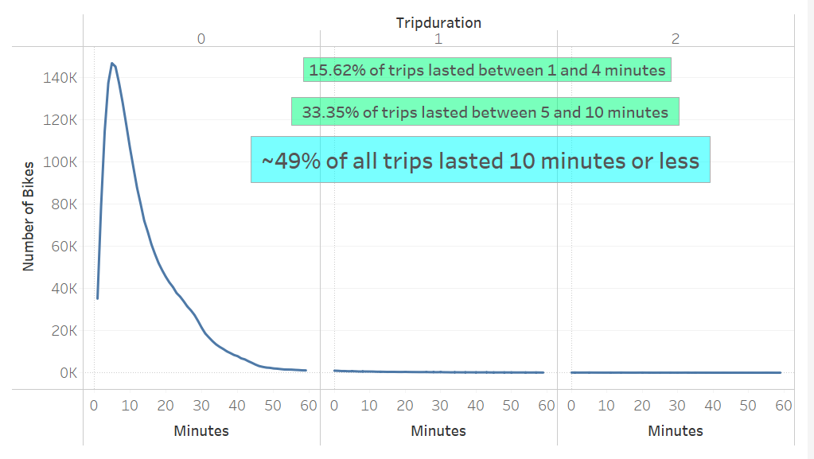
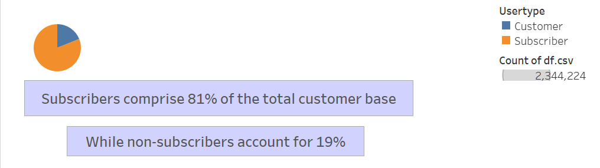
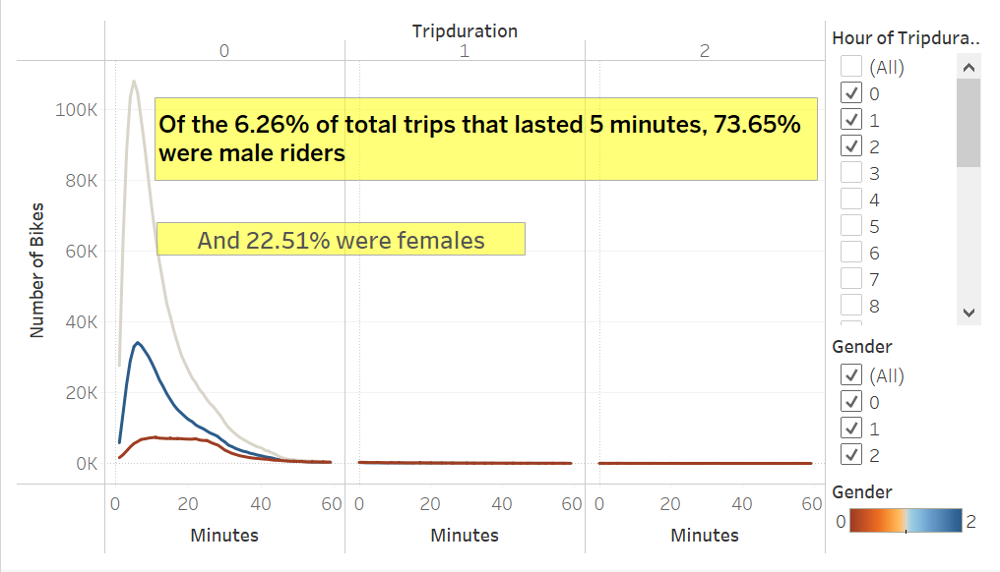
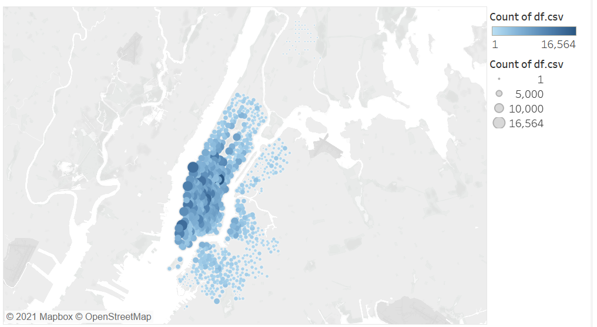
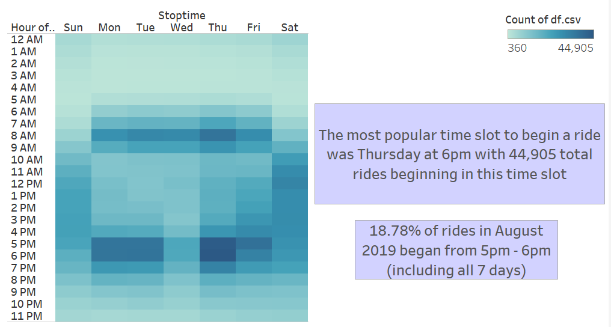
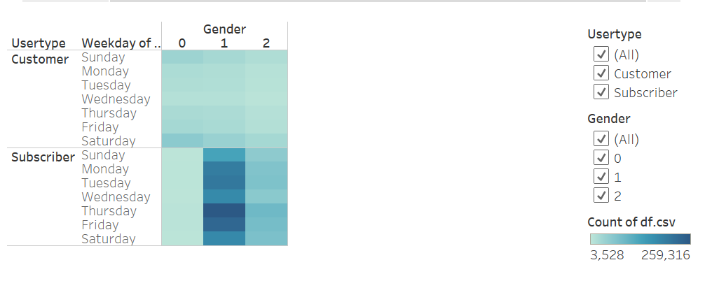
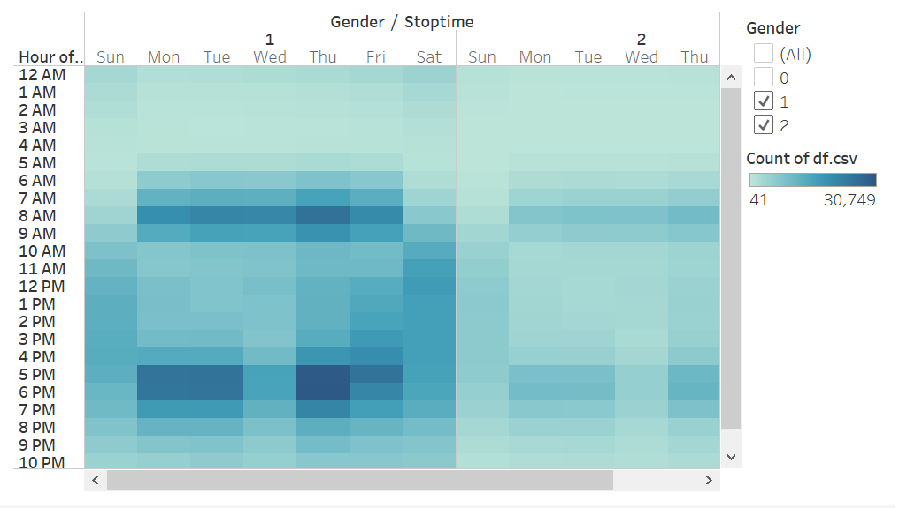

# Citi Bike Analysis: NYC --> Des Moines?
---
## Purpose
* The purpose of this analysis is to identify compelling reasons regarding why Des Moines, Iowa would be an ideal location for a Citi Bike bikesharing service to succeed. In doing so, we were given a CSV filled with Citi Bike's NYC trip data from August, 2019. From there, we were instructed to perform analysis on this data via Tableau to uncover trends that would support Des Moines, Iowa being a suitable location for a bikesharing service launch. Finally, we were tasked with piecing the various Tableau worksheets together to create a a Tableau story to present to potential investors in the Des Moines Citi Bike bikesharing program. 
---
## Results
[LINK TO TABLEAU STORY](https://public.tableau.com/app/profile/ben.mogil/viz/Module_14_Challenge_BenMogil/NYCCitiBikeStoryPres_?publish=yes "LINK TO TABLEAU STORY")
### Story Visualization #1: Checkout Times for Users

* This chart displays that of the 2,344,224 total rides recorded in this dataset, 781,808 (33.35%) of them had a trip duration of between 5 - 10 minutes. Further, 366,112, or 15.62% of trips, lasted from 1 - 4 minutes. Therefore, out of 2,344,224 total rides in August 2019,  49% of them lasted 10 minutes or less. Does this indicate that NYC's Citi Bike should be trying to increase each trip duration on average? (I would need access to their pricing model to answer this). On another note, does this indicate that NYC's CitiBike is primarily used by subscribers who are using the service to avoid the traffic-congested nature of NYC while commuting to work or other frequently traveled  destinations? Lets look at our customer breakdown to find out!

### Story Visualization #2: Customer Breakdown

* This data displays that our subscribers comrpise a significantly larger percentage of our entire customer base than non-subscribers. This could indicate that Citi Bike NYC has done a good job converting non-subscribed customers to subscribers, and that we might need to gather more information on the strategy they may've used to accomplish this. However, this implication cannot be confirmed since there is no data regarding how many current subscribers began as non-subscribers, and in that, how many rides on average did it take for them to be converted to a subscriber? Overall, this data does reveal that our current customer base is made up of ~80% subscribers, thereby supporting the prior hypothesis that our core customer base consists of people using the service to get to avoid traffic in getting to frequently traveled destinations.

### Story Visualization #3: Checkout Times by Gender

* Looking past the trip duration metric, this chart clearly shows that most of Citi Bike NYC's riders during August 2019 were males, indicating a potential target subset of a potential larger target demographic. However, in order to make an implication for the potential Des Moines launch, I would need more Des Moines demographic data to identify the likelihood that this trend could be replicated in Des Moines.

### Story Visualization #4: Top Starting Locations

* Manhattan area, which is a very popular tourist destination. However, there is a multitude of other suburban locations that recieved some traction as well. Overall, it is hard to conclude any signifcant insights without more data. For example, in regard to determining if Des Moines' Citi Bike would be a successful venture, I would want to know how many of the subscribers and customers are using their trips for leisure and how many are doing it to conveniently and cost-effectively avoid NYC traffic. Then, I would need to examine the city of Des Moines, Iowa to identify if the city would allow for convenient commute biking to avoid traffic ... is traffic even a problem there? ... Are the residential areas close enough to the commercial areas? And/or is there great scenery for leisure riding? All of these questions need answers for me to be able to provide a logical implication from the NYC data for the city of Des Moines. 

### Story Visualization #5: Trips by Weekday per Hour

As evidenced above, the best times to perform bike maintenance are Mon. - Fri. from 1am - 4am because the least number of rides began in this time slot. Despite Saturday - Sunday having signifcant vacancies from approx. 4am - 7am, the weekend afternoons seem to one of the most popular times to ride, so I would suggest not performing maintenance on these days because the risk of maintenance taking longer than anticipated could result in a high number of lost sales. Who knows if similar patterns would exist in Des Moines?

### Story Visualization #6: User Trips by Gender per Weekday

* At first glance this data is not very telling but it does reveal that the non-subscriber segment most frequently biked on Saturdays. Therefore, if we are aiming to maximize the customer-subscriber conversion rate, it would seem that Saturday is the optimal day to implement any such strategy.

### Story Visualization #7: Trips by Gender (Weekday per Hour)

* I dont believe this visualization adds any signifcant value because it it does not reveal any insight we haven't spoken about regarding gender. The only thing I believe could be significant is that there are much more male consumers than female consumers, but this has already been spoken about. However, I am putting it in the story because the module has instructed me to do so.
---
## Summary
* Overall I thoroughly enjoyed this assignment. However, I found it very hard to identify insights/trends from the given data that could be reasonably translated to compelling reasons that would support the proposed Citi Bike bikesharing launch in Des Moines, Iowa (Examples of this can be found in the above paragraphs below the visualization images). 
---
* The first additional visualization that I would perform on the given dataset would be a usertype breakdown. The chart could be a circle chart that differs in color depending on whether each rider was a subscriber or a non-subscriber. I believe this breakdown of usertype utilization would allow us to be able to better visualize how much revenue came from subscribers versus non-subscribers.
* The second additional visualization I would perform on the given dataset would be a trip duration by usertype chart. This chart could be a line chart that would segment usertype (subscriber vs. non-subscriber) and display the average trip duration for each segment. This could be even further broken down by subsetting gender within both these usertypes. I believe this visualization could reveal underlying trends and subsequent insights. For example, if the subscribers average trip duration was much smaller than the non-subscribers, this would indicate to me that most of the subscribers are in fact using the service for commuting purposes and the non-subscribers are using the service more for leisure rides. Of course, more analysis would be needed to conclude the prior point like when the subscribers most frequently ride (is it in the morning, during lunch and after work? A combination of those? None?). I believe analyzing this data would allow me to get a better sense of our customer motivation, and once this is analyzed, I would be able to observe/analyze data from the city of Des Moines to reasonably conclude whether or not I believe launching a bikesharing program in Des Moines would be successful.

